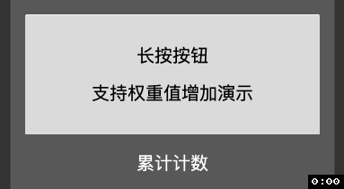

# Cocos Creator 扩展组件项目

[](https://github.com/zhitaocai/CocosCreatorExpandComponent/blob/master/CHANGELOG.md)
[](https://github.com/zhitaocai/CocosCreatorExpandComponent/blob/master/LICENSE)
[](http://www.cocos.com/creator)

## 1. 长按监听组件

### 效果图


*ps: 效果图来源于项目自带测试场景 [LongTouchTestScene.fire](./assets/LongTouchComponent/Scene/LongTouchTestScene.fire)，可以[下载项目](https://github.com/zhitaocai/CocosCreatorExpandComponent)下来直接运行预览或执行快速下载命令 ` git clone git@github.com:zhitaocai/CocosCreatorExpandComponent.git`*

### 支持说明

1. 支持点击回调（效果图前5秒演示效果）
2. 支持长按回调（效果图第5秒之后演示效果）
3. 支持长按期间离开节点，依旧回调长按，只有松手时才结束长按回调（效果图第8秒之后演示效果）

### 使用介绍

1. [LongTouchComponent.ts](./assets/LongTouchComponent/Script/LongTouchComponent.ts) 组件文件放入到自己的项目中
2. 将其拖入到需要支持长按操作的节点上
3. 在**属性编辑器**中设置长按回调事件
	
4. 实现长按回调事件
	```
	/**
     * 处理长按逻辑
     *
     * @param touchCounter 本次长按触摸次数
     * @param customEventData 在属性检查器中传入进来的 CustomEventData
     */
    handleToucheLogic(touchCounter: number, customEventData?: any) {
        this.longTouchCallBackLabel.string = `本次长按，回调了 ${touchCounter} 次`;
        console.log(`界面就不演示输出 CustomEventData了`);
        console.log(customEventData);
    }
	```
参数说明

| 参数                  | 说明                                                                           |
| --------------------- | ------------------------------------------------------------------------------ |
| Touch Interval        | 触摸回调间隔（秒）。假如为0.1，那么1秒内会回调10次 ``Long Touch Events`` 事件数组 |
| Enable Multi Touching | 是否支持多点触控（当前还不支持）                                               |
| Long Touch Events     | 回调事件数组，每间隔 ``Touche Interval`` 秒回调一次                               |

### **权重递增实现**

实际开发过程中，我们可能需要实现 **随着用户长按按钮时间越长，递增的数量要越来越多** ，我们暂且叫这种为 **权重递增** 方式。 文字描述可能比较抽象，实际效果如下：



1. 可以看到，点击1次，累计递增1次
2. 长按越久，累计递增的次数会越来越快（多）

实现以上方式，只需要利用回调函数中的 `长按触摸次数参数` 进行处理即可，具体代码如下：

```
/**
 * 累计计数
 */
private counter = 0;

/**
 * 处理长按逻辑
 *
 * @param touchCounter 本次长按触摸次数
 * @param customEventData 在属性检查器中传入进来的 CustomEventData
 */
handleMiddleBtnTouchLogic(touchCounter: number, customEventData?: any) {
    // 这里演示效果为：
    //  如果长按回调次数小于等于3次的，那么 累计次数 = 累计次数 + 1
    //  如果长按回调次数大于3次的，那么 累计次数 = 累计次数 + 权重公式后的结果
    if (touchCounter <= 3) {
        this.counter++;
    } else {
        // PS: 实际使用，开发者需要根据自己的期望权重递增公司来编写，这里仅为演示
        this.counter += Math.ceil((touchCounter - 3) * 1.003);
    }
    this.middleLongTouchCallBackLabel.string = `累计计数 ${this.counter} 次`;
}
```

### TODO

* [ ] 支持多点触控长按（即多根手指长按按钮时，每根手指都回调）

## 支持作者

如果我的工具对你起到帮助，不妨支持一下我吧~

🙏🙏🙏🙏🙏🙏🙏🙏🙏🙏🙏


## LICENSE

    MIT License

    Copyright (c) 2019 Zhitao Cai

    Permission is hereby granted, free of charge, to any person obtaining a copy
    of this software and associated documentation files (the "Software"), to deal
    in the Software without restriction, including without limitation the rights
    to use, copy, modify, merge, publish, distribute, sublicense, and/or sell
    copies of the Software, and to permit persons to whom the Software is
    furnished to do so, subject to the following conditions:

    The above copyright notice and this permission notice shall be included in all
    copies or substantial portions of the Software.

    THE SOFTWARE IS PROVIDED "AS IS", WITHOUT WARRANTY OF ANY KIND, EXPRESS OR
    IMPLIED, INCLUDING BUT NOT LIMITED TO THE WARRANTIES OF MERCHANTABILITY,
    FITNESS FOR A PARTICULAR PURPOSE AND NONINFRINGEMENT. IN NO EVENT SHALL THE
    AUTHORS OR COPYRIGHT HOLDERS BE LIABLE FOR ANY CLAIM, DAMAGES OR OTHER
    LIABILITY, WHETHER IN AN ACTION OF CONTRACT, TORT OR OTHERWISE, ARISING FROM,
    OUT OF OR IN CONNECTION WITH THE SOFTWARE OR THE USE OR OTHER DEALINGS IN THE
    SOFTWARE.