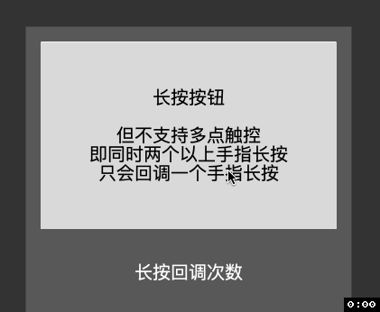
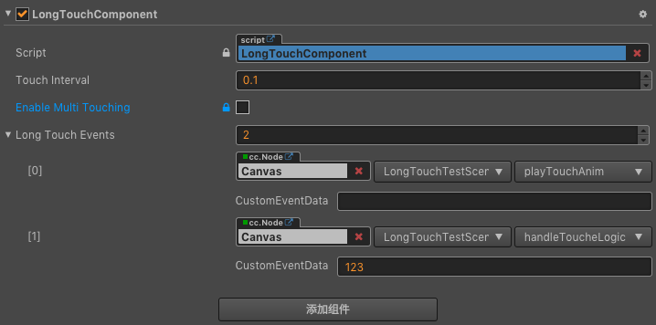

# Cocos Creator 扩展组件项目

[](https://github.com/zhitaocai/CocosCreatorExpandComponent/blob/master/CHANGELOG.md)
[](http://www.cocos.com/creator)

## 1. 长按监听组件

### 效果图



*ps:效果图来源于项目自带测试场景 [LongTouchTestScene.fire](./assets/LongTouchComponent/Scene/LongTouchTestScene.fire)，可以[下载项目](https://github.com/zhitaocai/CocosCreatorExpandComponent)下来直接运行预览，下载命令 ` git clone git@github.com:zhitaocai/CocosCreatorExpandComponent.git`*

### 支持说明

1. 支持点击回调（效果图前5秒演示效果）
2. 支持长按回调（效果图第5秒之后演示效果）
3. 支持长按期间离开节点，依旧回调长按，只有松手时才结束长按回调（效果图第8秒之后演示效果）

### 使用介绍

1. [LongTouchComponent.ts](./assets/LongTouchComponent/Script/LongTouchComponent.ts) 组件文件放入到自己的项目中
2. 将其拖入到需要支持长按操作的节点上
3. 在**属性编辑器**中设置长按回调事件
	
4. 实现长按回调事件
	```
	/**
     * 处理长按逻辑
     *
     * @param touchCounter 本次长按触摸次数
     * @param customEventData 在属性检查器中传入进来的 CustomEventData
     */
    handleToucheLogic(touchCounter: number, customEventData?: any) {
        this.longTouchCallBackLabel.string = `本次长按，回调了 ${touchCounter} 次`;
        console.log(`界面就不演示输出 CustomEventData了`);
        console.log(customEventData);
    }
	```
参数说明

| 参数                  | 说明                                                                           |
| --------------------- | ------------------------------------------------------------------------------ |
| Touch Interval        | 触摸回调间隔（秒）。假如为0.1，那么1秒内会回调10次 ``Long Touch Events`` 事件数组 |
| Enable Multi Touching | 是否支持多点触控（当前还不支持）                                               |
| Long Touch Events     | 回调事件数组，每间隔 ``Touche Interval`` 秒回调一次                               |

### TODO

* [ ] 支持多点触控长按（即多根手指长按按钮时，每根手指都回调）


## 支持作者

